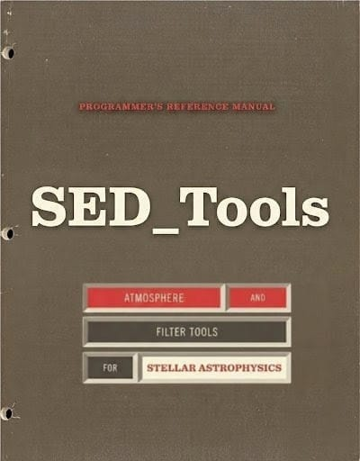
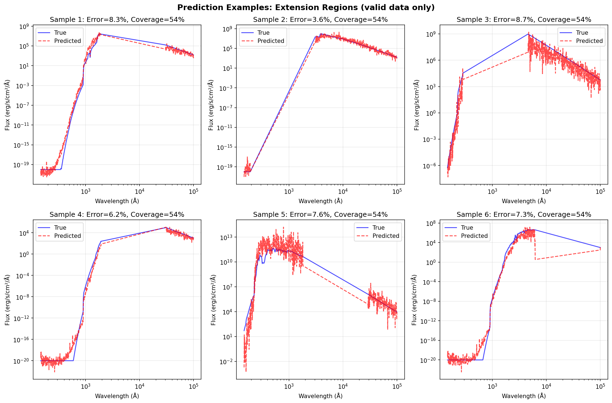
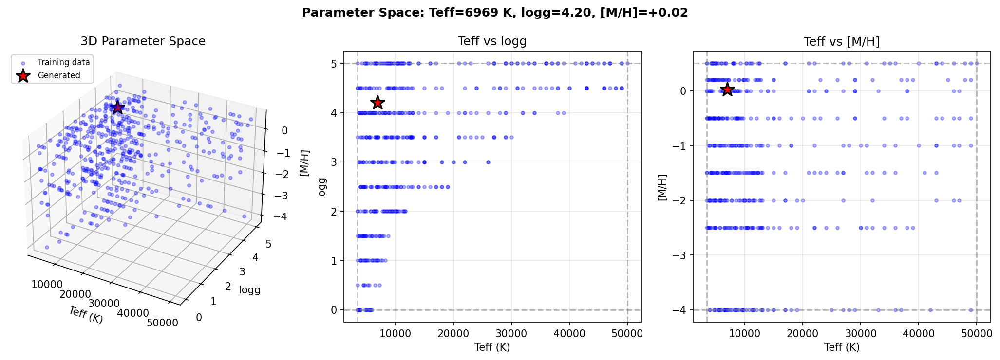
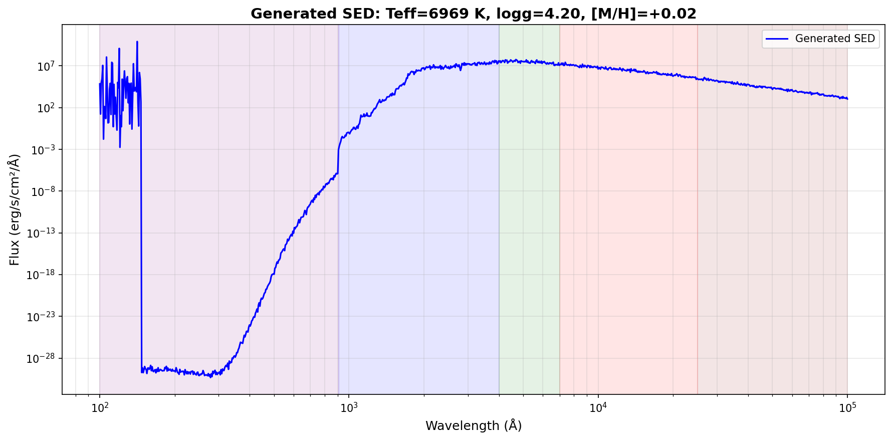

<p align="center">
  
</p>

<h1 align="center">SED_Tools</h1>

<p align="center">
  <strong>Download, process, and standardize stellar atmosphere models for MESA</strong>
</p>

<p align="center">
  <a href="#installation">Installation</a> •
  <a href="#quick-start">Quick Start</a> •
  <a href="#cli-reference">CLI Reference</a> •
  <a href="#python-api">Python API</a> •
  <a href="#data-sources">Data Sources</a>
</p>

---

## Overview

SED_Tools is a Python package for working with stellar spectral energy distributions (SEDs). It provides unified access to multiple stellar atmosphere catalogs, standardizes spectral data to consistent units, and generates output files compatible with [MESA](https://docs.mesastar.org/)'s `colors` module.

### Key Features

- **Multi-source downloads** — Fetch stellar atmosphere spectra from SVO, MSG, MAST (BOSZ), and NJM mirror
- **Photometric filters** — Download transmission curves from the SVO Filter Profile Service
- **Unit standardization** — Convert all spectra to consistent units (wavelength in Å, flux in erg/cm²/s/Å)
- **MESA integration** — Generate binary flux cubes, HDF5 bundles, and lookup tables
- **Grid combination** — Merge multiple stellar libraries into unified "omni grids"
- **ML completion** — Extend incomplete SEDs to broader wavelength ranges using neural networks
- **ML generation** — Create complete SEDs from stellar parameters (Teff, logg, [M/H]) using neural networks

---

## Installation

### From Source

```bash
git clone https://github.com/yourusername/SED_Tools.git
cd SED_Tools
pip install .
```

### Development Install

```bash
pip install -e .
```

### Requirements

- Python ≥ 3.9
- numpy, pandas, h5py, astropy, matplotlib
- PyTorch (required for ML completer and generator)

See `pyproject.toml` for the complete dependency list.

---

## Quick Start

### Interactive Mode

Launch the interactive menu:

```bash
sed-tools
```

### Direct Commands

```bash
# Download stellar atmosphere spectra
sed-tools spectra

# Download photometric filter transmission curves
sed-tools filters

# Build flux cubes and lookup tables from downloaded spectra
sed-tools rebuild

# Combine multiple grids into a unified ensemble
sed-tools combine

# Train or apply the ML SED completer (extends existing spectra)
sed-tools ml_completer

# Train or apply the ML SED generator (creates SEDs from parameters)
sed-tools ml_generator
```

---

## CLI Reference

### `sed-tools spectra`

Download stellar atmosphere spectra from remote catalogs.

```bash
# Interactive source and model selection
sed-tools spectra

# Download specific models
sed-tools spectra --models Kurucz2003all PHOENIX

# Force a specific source
sed-tools spectra --source svo --models Kurucz2003all

# Parallel downloads
sed-tools spectra --models Kurucz2003all --workers 8

```

**What it does:**

1. Queries the selected source for available models
2. Downloads spectrum files matching your criteria
3. Standardizes units (wavelength → Å, flux → erg/cm²/s/Å)
4. Generates `lookup_table.csv` with stellar parameters
5. Automatically runs `rebuild` to create binary files

**Sources:**

| Source | Description |
|--------|-------------|
| `njm` | NJM server (default, fastest) |
| `svo` | Spanish Virtual Observatory |
| `msg` | MSG grids (Townsend) |
| `mast` | MAST BOSZ library |

---

### `sed-tools filters`

Download photometric filter transmission curves from the SVO Filter Profile Service.

```bash
# Interactive facility/instrument/filter selection
sed-tools filters
```

**Output structure:**

```
data/filters/Generic/Johnson/
├── B.dat           # Filter transmission curve
├── V.dat
├── R.dat
└── Johnson         # Index file for MESA
```

---

### `sed-tools rebuild`

Build MESA-compatible binary files from downloaded text spectra.

```bash
# Rebuild all local models
sed-tools rebuild

# Rebuild specific models
sed-tools rebuild --models Kurucz2003all PHOENIX
```

**Generated files:**

| File | Description |
|------|-------------|
| `flux_cube.bin` | Binary flux cube (required by MESA) |
| `lookup_table.csv` | Parameter lookup table |
| `*.h5` | HDF5 bundle with all spectra |

---

### `sed-tools combine`

Merge multiple stellar atmosphere grids into a unified ensemble.

```bash
# Interactive model selection
sed-tools combine

# Combine all available local models
sed-tools combine --non-interactive
```

**Use cases:**

- Extend temperature coverage by combining hot and cool star models
- Fill gaps in parameter space using complementary libraries
- Create comprehensive grids for population synthesis

---

### `sed-tools ml_completer`

<p>
  
</p>


Train and apply neural networks to extend incomplete SEDs to broader wavelength ranges.

**Use case:** You have spectra with limited wavelength coverage (e.g., optical-only) and need to extend them into UV or IR.

```bash
# Interactive mode
sed-tools ml_completer
```

**How it works:**

1. Trains on complete SED libraries with full wavelength coverage
2. Uses black body radiation as a physics-based baseline
3. Neural network learns corrections to the black body approximation
4. Masked training handles heterogeneous wavelength grids
5. Blends ML predictions with black body at extrapolation boundaries

---

### `sed-tools ml_generator`


<p>
  
</p>

Train and apply neural networks to generate complete SEDs from stellar parameters alone.

**Use case:** You need SEDs for arbitrary stellar parameters but don't have an input spectrum — just Teff, logg, and [M/H].

```bash
# Interactive mode
sed-tools ml_generator
```

**How it works:**

1. Trains on flux cubes mapping (Teff, logg, [M/H]) → full SED
2. Network learns the complete spectral shape from 3 parameters
3. Log-scaling and normalization handle flux dynamic range
4. Generates diagnostic plots showing parameter space coverage

<p>
  
</p>

<p>
  
</p>


---

## Python API

The Python API provides full parity with the CLI plus additional capabilities for building data pipelines.

### `SED` — Main Entry Point

#### Discovery

```python
from sed_tools.api import SED

# List all available catalogs
catalogs = SED.query()

# Filter by source
catalogs = SED.query(source='svo')

# Filter by parameter coverage
catalogs = SED.query(
    teff_min=5000,
    teff_max=7000,
    logg_min=3.5,
    metallicity_min=-1.0,
)

# Local catalogs only
catalogs = SED.query(include_remote=False)
```

#### Downloading

```python
# Basic fetch (tries NJM mirror first, falls back to other sources)
sed = SED.fetch('Kurucz2003all')

# Force specific source
sed = SED.fetch('Kurucz2003all', source='svo')

# Fetch with parameter filtering and parallel downloads
sed = SED.fetch(
    'Kurucz2003all',
    teff_min=4000,
    teff_max=8000,
    logg_min=3.0,
    logg_max=5.0,
    metallicity_min=-1.0,
    metallicity_max=0.5,
    workers=8,
)

# Save to disk (generates all MESA-compatible files)
sed.cat.write()
sed.cat.write('/custom/output/path')
```

#### Loading Local Data

```python
# Load an installed catalog
sed = SED.local('Kurucz2003all')

# Check parameter coverage
ranges = sed.parameter_ranges()
# {'teff': (3500.0, 50000.0), 'logg': (0.0, 5.0), 'metallicity': (-5.0, 1.0)}
```

#### Interpolation

```python
sed = SED.local('Kurucz2003all')

# Interpolate a spectrum at specific stellar parameters
spectrum = sed(teff=5777, logg=4.44, metallicity=0.0)

print(spectrum.wavelength)  # Array in Angstroms
print(spectrum.flux)        # Array in erg/cm²/s/Å
```

#### Combining Grids

```python
ensemble = SED.combine(
    catalogs=['Kurucz2003all', 'PHOENIX', 'NextGen'],
    output='my_combined_grid',
)
```

#### ML Completion

```python
completer = SED.ml_completer()

# Train on a complete grid
completer.train(grid='combined_grid', epochs=200)

# Extend an incomplete model
extended = completer.extend(
    'sparse_model',
    wavelength_range=(100, 100000),
)
extended.write()
```

#### ML Generation

```python
generator = SED.ml_generator()

# Train on a stellar atmosphere library
generator.train(grid='Kurucz2003all', epochs=200)

# Generate a single SED
wl, flux = generator.generate(teff=5777, logg=4.44, metallicity=0.0)

# Generate with diagnostic plots
wl, flux = generator.generate_with_outputs(
    teff=5777, 
    logg=4.44, 
    metallicity=0.0,
    output_dir='output/sun_sed',
)

# Or load a pre-trained model
generator = SED.ml_generator()
generator.load('sed_generator_Kurucz2003all')
wl, flux = generator.generate(teff=6000, logg=4.0, metallicity=-0.5)

# Check parameter ranges
ranges = generator.parameter_ranges()
# {'teff': (3500.0, 50000.0), 'logg': (0.0, 5.0), 'metallicity': (-5.0, 1.0)}
```

---

### `Catalog` — Spectrum Container

```python
catalog = sed.cat

# Properties
len(catalog)              # Number of spectra
catalog.teff_grid         # Unique Teff values
catalog.logg_grid         # Unique logg values
catalog.parameters        # DataFrame of all parameters

# Iteration
for spec in catalog:
    print(spec.teff, spec.logg, spec.metallicity)

# Filtering
cool_stars = catalog.filter(teff_max=5000)

# Persistence
catalog.write()
catalog.write('/custom/path')
```

---

### `Spectrum` — Individual SED

```python
spec = catalog[0]

# Data arrays
spec.wavelength    # np.ndarray (Angstroms)
spec.flux          # np.ndarray (erg/cm²/s/Å)
spec.wl            # Alias for wavelength
spec.fl            # Alias for flux

# Stellar parameters
spec.teff          # Effective temperature (K)
spec.logg          # Surface gravity (log g)
spec.metallicity   # [M/H]

# Metadata
spec.filename      # Original filename

# Save individual spectrum
spec.save('/path/to/spectrum.txt')
```

---

### `Filters` — Photometric Filters

```python
from sed_tools.api import Filters

# Query available filters
all_filters = Filters.query()
hst_filters = Filters.query(facility='HST')

# Download a filter set
path = Filters.fetch(facility='Generic', instrument='Johnson')
```

---

### `CatalogInfo` — Catalog Metadata

```python
info = SED.query()[0]

info.name              # 'Kurucz2003all'
info.source            # 'svo', 'njm', 'local', etc.
info.teff_range        # (3500.0, 50000.0)
info.logg_range        # (0.0, 5.0)
info.metallicity_range # (-5.0, 1.0)
info.n_spectra         # Number of spectra
info.is_local          # True if already installed

# Coverage checks
info.covers(teff=5777, logg=4.44)
info.covers_range(teff_min=5000, teff_max=6000)
```

---

### CLI to API Mapping

| CLI Command | Python API Equivalent |
|-------------|----------------------|
| `sed-tools spectra` (list) | `SED.query()` |
| `sed-tools spectra --models X` | `SED.fetch('X')` |
| `sed-tools rebuild --models X` | `sed.cat.write()` |
| `sed-tools combine --models A B` | `SED.combine(['A', 'B'], output='...')` |
| `sed-tools ml_completer train` | `SED.ml_completer().train(...)` |
| `sed-tools ml_generator train` | `SED.ml_generator().train(...)` |
| `sed-tools ml_generator generate` | `SED.ml_generator().generate(...)` |
| `sed-tools filters` | `Filters.fetch(...)` |

---

## MESA Integration

### Installing Downloaded Data

Copy or symlink the generated data into your MESA installation:

```bash
# Copy
cp -r data/stellar_models/Kurucz2003all $MESA_DIR/colors/data/stellar_models/

# Or symlink (recommended for development)
ln -s $(pwd)/data/stellar_models/Kurucz2003all $MESA_DIR/colors/data/stellar_models/
```

### MESA Inlist Configuration

```fortran
&controls
    ! Stellar atmosphere model
    stellar_atm = '/colors/data/stellar_models/Kurucz2003all/'
    
    ! Photometric filter set
    instrument = '/colors/data/filters/Generic/Johnson'
/
```

### Filter Specifications

When referencing filters in MESA, use the filename stem only:

- File: `data/filters/GAIA/GAIA/G.dat`
- Reference: `"G"`

---

## Directory Structure

```
SED_Tools/
├── sed_tools/              # Package source
│   ├── __init__.py
│   ├── api.py              # Python API
│   ├── cli.py              # CLI entry point
│   └── ...
├── data/                   # Downloaded data (created at runtime)
│   ├── stellar_models/
│   │   └── Kurucz2003all/
│   │       ├── flux_cube.bin
│   │       ├── lookup_table.csv
│   │       ├── spectra.h5
│   │       └── *.txt
│   └── filters/
│       └── Generic/
│           └── Johnson/
│               ├── B.dat
│               ├── V.dat
│               └── Johnson
├── docs/
├── tests/
├── pyproject.toml
└── README.md
```

---

## Data Sources

| Source | URL | Description |
|--------|-----|-------------|
| NJM Server | [nialljmiller.com/SED_Tools/](https://nialljmiller.com/SED_Tools/) | Pre-processed data host (fastest) |
| SVO | [svo2.cab.inta-csic.es](http://svo2.cab.inta-csic.es/theory/fps/) | Spanish Virtual Observatory |
| MSG | [astro.wisc.edu/~townsend](http://user.astro.wisc.edu/~townsend/static.php?ref=msg-grids) | MSG Stellar Atmosphere Grids |
| MAST | [archive.stsci.edu/prepds/bosz](https://archive.stsci.edu/prepds/bosz/) | BOSZ Spectral Library |

---

## Examples

### Batch Processing a Star Catalog

```python
from sed_tools.api import SED

sed = SED.local('Kurucz2003all')

stars = [
    {'name': 'Sun',         'teff': 5777, 'logg': 4.44, 'met':  0.0},
    {'name': 'Vega',        'teff': 9940, 'logg': 4.30, 'met':  0.0},
    {'name': 'Proxima Cen', 'teff': 3050, 'logg': 5.20, 'met': -0.1},
]

for star in stars:
    spectrum = sed(star['teff'], star['logg'], star['met'])
    spectrum.save(f"output/{star['name']}.txt")
```

### Building a Custom Temperature Grid

```python
from sed_tools.api import SED

# Hot stars from Kurucz
hot = SED.fetch('Kurucz2003all', teff_min=7000, teff_max=50000)
hot.cat.write()

# Cool stars from PHOENIX
cool = SED.fetch('PHOENIX', teff_min=2500, teff_max=7000)
cool.cat.write()

# Combine into unified grid
combined = SED.combine(
    ['Kurucz2003all', 'PHOENIX'],
    output='full_temperature_grid'
)
```

### Extending UV Coverage with ML

```python
from sed_tools.api import SED

# Train on a grid with complete wavelength coverage
completer = SED.ml_completer()
completer.train('BOSZ', epochs=200)

# Extend a model with limited UV coverage
extended = completer.extend(
    'optical_only_model',
    wavelength_range=(912, 100000),  # Extend into UV
)
extended.write()
```

### Generating SEDs for Arbitrary Parameters

```python
from sed_tools.api import SED

# Train a generator on a comprehensive grid
generator = SED.ml_generator()
generator.train('Kurucz2003all', epochs=200)

# Generate SEDs for a list of stars
stars = [
    {'name': 'Sun',    'teff': 5777, 'logg': 4.44, 'met':  0.0},
    {'name': 'Vega',   'teff': 9940, 'logg': 4.30, 'met':  0.0},
    {'name': 'Sirius', 'teff': 9940, 'logg': 4.30, 'met':  0.5},
]

for star in stars:
    wl, flux = generator.generate(
        teff=star['teff'],
        logg=star['logg'],
        metallicity=star['met'],
    )
    # Save or process the SED
    import numpy as np
    np.savetxt(f"output/{star['name']}.txt", np.column_stack([wl, flux]))
```

---

## Troubleshooting

### Common Issues

**Downloads fail or timeout**

```bash
# Use the NJM mirror (faster, more reliable)
sed-tools spectra --source njm --models Kurucz2003all

# Or reduce parallel workers
sed-tools spectra --models Kurucz2003all --workers 2
```

**Missing PyTorch for ML tools**

```bash
pip install torch
```

**MESA cannot find flux cube**

Verify the directory structure matches MESA expectations:

```
$MESA_DIR/colors/data/stellar_models/Kurucz2003all/
├── flux_cube.bin       # Must exist
└── lookup_table.csv    # Must exist
```

---

## License

[MIT License](LICENSE)

---

## Acknowledgments

- [MESA](https://docs.mesastar.org/) — Modules for Experiments in Stellar Astrophysics
- [SVO Filter Profile Service](http://svo2.cab.inta-csic.es/theory/fps/) — Filter transmission curves
- [MAST](https://archive.stsci.edu/) — Mikulski Archive for Space Telescopes
- [MSG Grids](http://user.astro.wisc.edu/~townsend/static.php?ref=msg-grids) — Rich Townsend's stellar atmosphere grids
