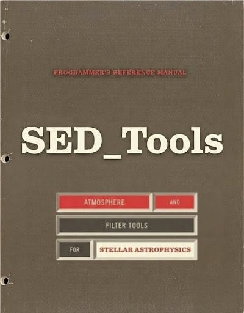
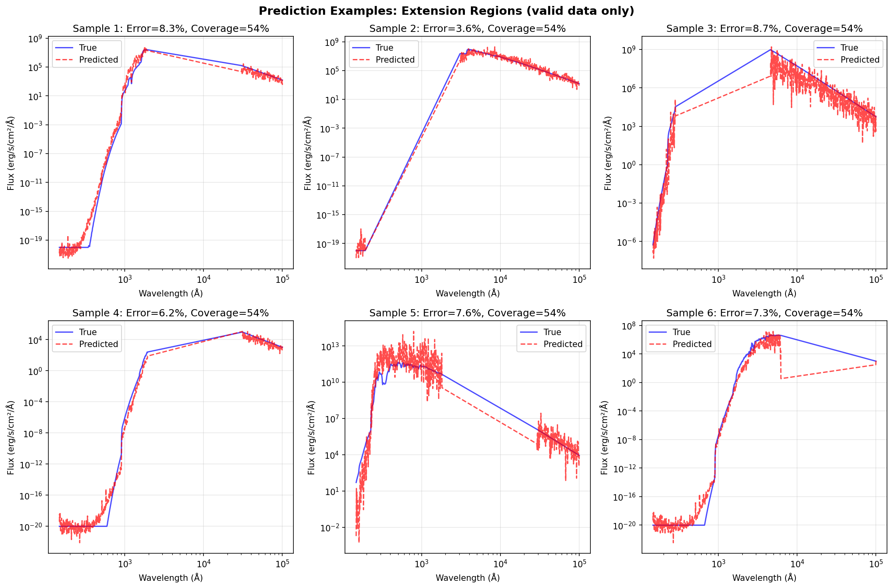
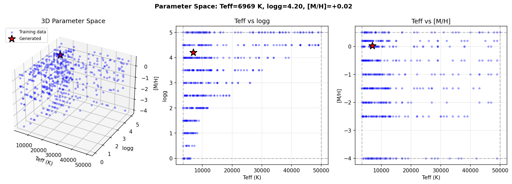
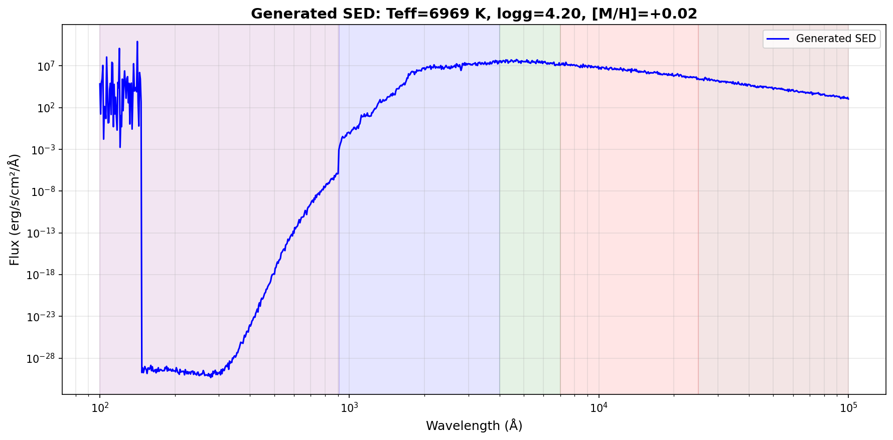

<p align="center">
  
</p>

<h1 align="center">SED_Tools</h1>

<p align="center">
  <strong>Download, process, and standardize stellar atmosphere models for SED_Model and MESA</strong>
</p>

<p align="center">
  <a href="https://github.com/nialljmiller/SED_Tools/actions/workflows/tests.yml"></a>
</p>

<p align="center">
  <a href="#installation">Installation</a> •
  <a href="#quick-start">Quick Start</a> •
  <a href="#cli-reference">CLI Reference</a> •
  <a href="#python-api">Python API</a> •
  <a href="#data-sources">Data Sources</a>
</p>

---

## Overview

SED_Tools is a Python package for working with stellar spectral energy distributions (SEDs). It provides unified access to multiple stellar atmosphere catalogs, standardizes spectral data to consistent units, and generates output files compatible with [MESA](https://docs.mesastar.org/)'s `colors` module, [SED_Model](https://github.com/nialljmiller/SED_Model) and other codes.

### Key Features

- **Multi-source downloads** — Fetch stellar atmosphere spectra from SVO, MSG, MAST (BOSZ), and NJM mirror
- **Photometric filters** — Download transmission curves from the NJM mirror with SVO Filter Profile Service fallback
- **Unit standardization** — Convert all spectra to consistent units (wavelength in Å, flux in erg/cm²/s/Å)
- **External integration** — Generate binary flux cubes, HDF5 bundles, and lookup tables. This is for [SED_Model](https://github.com/nialljmiller/SED_Model) and [MESA](https://docs.mesastar.org/)'s `colors` module
- **Grid combination** — Merge multiple stellar libraries into unified "omni grids"
- **ML completion** — Extend incomplete SEDs to broader wavelength ranges using neural networks
- **ML generation** — Create complete SEDs from stellar parameters (Teff, logg, [M/H]) using neural networks

---

## Installation

### From PIP

```bash
pip install sed-tools
```

### From Source

```bash
git clone https://github.com/nialljmiller/SED_Tools.git
cd SED_Tools
pip install .
```

### Development Install

```bash
pip install -e .
```

### Requirements

- Python ≥ 3.9
- numpy, pandas, h5py, astropy, matplotlib
- PyTorch (required for ML completer and generator)

See `pyproject.toml` for the complete dependency list.

---

## Quick Start

### Interactive Mode

Launch the interactive menu:

```bash
sed-tools
```

### Direct Commands

```bash
# Download photometric filter transmission curves
sed-tools filters

# Combine installed filter sets
sed-tools filters-combine Gaia2MASS GAIA/GAIA 2MASS/2MASS

# Download stellar atmosphere spectra
sed-tools spectra

# Build flux cubes and lookup tables from downloaded spectra
sed-tools rebuild

# Combine multiple grids into a unified ensemble
sed-tools combine

# Train or apply the ML SED completer (extends existing spectra)
sed-tools ml_completer

# Train or apply the ML SED generator (creates SEDs from parameters)
sed-tools ml_generator

# Fill coarse Teff gaps in a flux cube (eliminates MESA interpolation steps)
sed-tools densify --flux-cube data/stellar_models/tmap2/flux_cube.bin \
                  --output data/stellar_models/tmap2_dense/flux_cube.bin \
                  --teff-spacing 1000

# Ingest an external grid of .txt spectra into the pipeline
sed-tools import --path /path/to/spectra/ --name MyGrid

# Report parameter-space coverage of an installed grid
sed-tools coverage --models Kurucz2003all

# Show or set the data directory
sed-tools config
sed-tools config --set /path/to/data --move
```

---

## CLI Reference

### `sed-tools filters`

Download photometric filter transmission curves interactively. The browser merges the SVO Filter Profile Service catalogue with the NJM mirror: facilities that exist on SVO are listed first, and any facilities available **only** on the NJM mirror are surfaced alongside them (marked `[NJM]`). Filters are fetched from the NJM mirror when available (fastest), with automatic fallback to SVO for everything else.

```bash
# Interactive facility/instrument/filter selection
sed-tools filters
```

**Output structure:**

```
data/filters/Generic/Johnson/
├── B.dat           # Filter transmission curve
├── V.dat
├── R.dat
└── Johnson         # Index file for MESA
```

Downloaded filter sets can be combined without rebuilding spectra or flux cubes, because a filter set is only a directory of ``*.dat`` curves plus the MESA index file whose lines list those curves. The helper below copies the selected curves into a new instrument folder and writes the matching index file automatically.

```bash
# Create data/filters/Combined/Gaia2MASS/ with a Gaia2MASS index file
sed-tools filters-combine Gaia2MASS GAIA/GAIA 2MASS/2MASS

# Pick custom MESA-facing labels and fail on duplicate band names
sed-tools filters-combine optical_ir Generic/Johnson 2MASS/2MASS \
  --facility Custom --instrument optical_ir --on-conflict error
```

The same operation is available from Python:

```python
from sed_tools.api import Filters

combined = Filters.combine("Gaia2MASS", "GAIA/GAIA", "2MASS/2MASS")
print(combined)
```

---


### `sed-tools spectra`

Download stellar atmosphere spectra from remote catalogs.

```bash
# Interactive source and model selection
sed-tools spectra

# Download specific models
sed-tools spectra --models Kurucz2003all

# Force a specific source
sed-tools spectra --source svo --models Kurucz2003all

# Parallel downloads
sed-tools spectra --models Kurucz2003all --workers 8

```

**What it does:**

1. Queries the selected source for available models
2. Downloads spectrum files matching your criteria
3. Standardizes units (wavelength → Å, flux → erg/cm²/s/Å)
4. Generates `lookup_table.csv` with stellar parameters
5. Automatically runs `rebuild` to create binary files

**Sources:**

| Source | Description |
|--------|-------------|
| `njm` | NJM server (default, fastest) |
| `svo` | Spanish Virtual Observatory |
| `msg` | MSG grids (Townsend) |
| `mast` | MAST BOSZ library |

---

### `sed-tools rebuild`

Build MESA-compatible binary files from downloaded text spectra.

```bash
# Rebuild all local models
sed-tools rebuild

# Rebuild specific models
sed-tools rebuild --models Kurucz2003all
```

**Generated files:**

| File | Description |
|------|-------------|
| `flux_cube.bin` | Binary flux cube (required by [SED_Model](https://github.com/nialljmiller/SED_Model) and other codes, such as MESA)|
| `lookup_table.csv` | Parameter lookup table |
| `*.h5` | HDF5 bundle with all spectra |

---

### `sed-tools combine`

Merge multiple stellar atmosphere grids into a unified ensemble.

```bash
# Interactive model selection
sed-tools combine

# Combine all available local models
sed-tools combine --non-interactive
```

**Use cases:**

- Extend temperature coverage by combining hot and cool star models
- Fill gaps in parameter space using complementary libraries
- Create comprehensive grids for population synthesis

---

### `sed-tools ml_completer`

<p>
  
</p>


Train and apply neural networks to extend incomplete SEDs to broader wavelength ranges.

**Use case:** You have spectra with limited wavelength coverage (e.g., optical-only) and need to extend them into UV or IR.

```bash
# Interactive mode
sed-tools ml_completer
```

**How it works:**

1. Trains on complete SED libraries with full wavelength coverage
2. Uses black body radiation as a physics-based baseline
3. Neural network learns corrections to the black body approximation
4. Masked training handles heterogeneous wavelength grids
5. Blends ML predictions with black body at extrapolation boundaries

---

### `sed-tools ml_generator`


<p>
  
</p>

Train and apply neural networks to generate complete SEDs from stellar parameters alone.

**Use case:** You need SEDs for arbitrary stellar parameters but don't have an input spectrum — just Teff, logg, and [M/H].

```bash
# Interactive mode
sed-tools ml_generator
```

**How it works:**

1. Trains on flux cubes mapping (Teff, logg, [M/H]) → full SED
2. Network learns the complete spectral shape from 3 parameters
3. Log-scaling and normalization handle flux dynamic range
4. Generates diagnostic plots showing parameter space coverage

<p>
  
</p>

<p>
  
</p>

---

### `sed-tools densify`

Fill coarse Teff gaps in an existing flux cube to eliminate stair-stepping artefacts in MESA photometric outputs. New Teff nodes are filled with ML predictions (when a generator model is provided and the point is within its training range) or a Planck blackbody scaled to the nearest real SED's bolometric flux. The densifier never loads the full cube into RAM — it uses `np.memmap` throughout.

```bash
# Densify with blackbody fallback (no ML model)
sed-tools densify \
  --flux-cube data/stellar_models/tmap2/flux_cube.bin \
  --output data/stellar_models/tmap2_dense/flux_cube.bin \
  --teff-spacing 1000

# Densify with ML generator for in-range points, blackbody elsewhere
sed-tools densify \
  --flux-cube data/stellar_models/tmap2/flux_cube.bin \
  --output data/stellar_models/tmap2_dense/flux_cube.bin \
  --teff-spacing 1000 \
  --ml-model data/stellar_models/models/sed_generator_Kurucz2003all
```

See [notebook 10](jupyter_notebooks/10_grid_densification.ipynb) for a worked example including before/after comparison plots.

---

### `sed-tools import`

Ingest an external directory of `.txt` spectra (with parameter headers) into the SED_Tools pipeline. Files are copied or moved into the configured model root, then processed through the standard clean → lookup → HDF5 → flux-cube pipeline.

```bash
# Import spectra, build all outputs
sed-tools import --path /path/to/my_spectra/ --name MyGrid

# Preview parseable headers without importing
sed-tools import --path /path/to/my_spectra/ --name MyGrid --dry-run

# Move files instead of copying; skip HDF5 bundle
sed-tools import --path /path/to/my_spectra/ --name MyGrid --move --no-h5
```

---

### `sed-tools coverage`

Report parameter-space coverage statistics for one or more installed grids. Prints per-axis ranges, unique grid values, fill fraction, and optionally writes a Teff–logg + 3D scatter plot.

```bash
# Report and plot coverage for a single model
sed-tools coverage --models Kurucz2003all

# Report without generating a plot
sed-tools coverage --models Kurucz2003all --no-plot
```

---

### `sed-tools mesa_prepare`

Export a specific extra-axis sub-variant (e.g. one alpha-enhancement, turbulent velocity, or mixing length combination) from a model that has multiple variants in its `fluxcube_library/`. Produces a clean, self-contained MESA-ready folder containing only the selected variant's flux cube.

```bash
# Interactive model and variant selection
sed-tools mesa_prepare
```

---

### `sed-tools config`

Show or change the root data directory where SED_Tools stores stellar models and filters.

```bash
# Show current data directory
sed-tools config

# Change the data directory (and optionally move existing data)
sed-tools config --set /new/data/path --move
```

---

## Python API

The Python API provides full parity with the CLI plus additional capabilities for building data pipelines.

### `SED` — Main Entry Point

#### Discovery

```python
from sed_tools.api import SED

# List all available catalogs
catalogs = SED.query()

# Filter by source
catalogs = SED.query(source='svo')

# Filter by parameter coverage
catalogs = SED.query(
    teff_min=5000,
    teff_max=7000,
    logg_min=3.5,
    metallicity_min=-1.0,
)

# Local catalogs only
catalogs = SED.query(include_remote=False)
```

#### Downloading

```python
# Basic fetch (tries NJM mirror first, falls back to other sources)
sed = SED.fetch('Kurucz2003all')

# Force specific source
sed = SED.fetch('Kurucz2003all', source='svo')

# Fetch with parameter filtering and parallel downloads
sed = SED.fetch(
    'Kurucz2003all',
    teff_min=4000,
    teff_max=8000,
    logg_min=3.0,
    logg_max=5.0,
    metallicity_min=-1.0,
    metallicity_max=0.5,
    workers=8,
)

# Save to disk (generates all SED_Model/MESA-compatible files)
sed.cat.write()
sed.cat.write('/custom/output/path')
```

#### Loading Local Data

```python
# Load an installed catalog
sed = SED.local('Kurucz2003all')

# Check parameter coverage
ranges = sed.parameter_ranges()
# {'teff': (3500.0, 50000.0), 'logg': (0.0, 5.0), 'metallicity': (-5.0, 1.0)}
```

#### Interpolation

```python
sed = SED.local('Kurucz2003all')

# Interpolate a spectrum at specific stellar parameters
spectrum = sed(teff=5777, logg=4.44, metallicity=0.0)

print(spectrum.wavelength)  # Array in Angstroms
print(spectrum.flux)        # Array in erg/cm²/s/Å
```

#### Synthetic Photometry

<!-- SED_TOOLS_FILTER_SET_PHOTOMETRY_DOC -->

`EvaluatedSED.photometry(...)` accepts individual filter names, filter files, or a filter-set / instrument directory name. For example, with the standard MESA colors-data layout, `"GAIA"` expands to the files in `filters/GAIA/GAIA/`.

```python
import os
from pathlib import Path
from sed_tools.api import SED

colors_data = Path(os.path.expandvars("$MESA_DIR")) / "data/colors_data"

sed = SED.local(
    "Kurucz2003all",
    model_root=colors_data / "stellar_models",
    filter_root=colors_data / "filters",
)

spec = sed(teff=6000, logg=2.0, metallicity=-1.0)
phot = spec.photometry("GAIA", system="AB")

mags = {res.filter_name: res.magnitude for res in phot.values()}
bp_rp = mags["Gbp"] - mags["Grp"]
print(bp_rp)
```

If a filter specification is ambiguous, pass a specific file path or a specific filter directory.

#### Combining Grids

```python
ensemble = SED.combine(
    catalogs=['Kurucz2003all', 'NextGen'],
    output='my_combined_grid',
)
```

#### ML Completion

```python
completer = SED.ml_completer()

# Train on a complete grid
completer.train(grid='combined_grid', epochs=200)

# Extend an incomplete model
extended = completer.extend(
    'sparse_model',
    wavelength_range=(100, 100000),
)
extended.write()
```

#### ML Generation

```python
generator = SED.ml_generator()

# Train on a stellar atmosphere library
generator.train(grid='Kurucz2003all', epochs=200)

# Generate a single SED
wl, flux = generator.generate(teff=5777, logg=4.44, metallicity=0.0)

# Generate with diagnostic plots
wl, flux = generator.generate_with_outputs(
    teff=5777, 
    logg=4.44, 
    metallicity=0.0,
    output_dir='output/sun_sed',
)

# Or load a pre-trained model
generator = SED.ml_generator()
generator.load('sed_generator_Kurucz2003all')
wl, flux = generator.generate(teff=6000, logg=4.0, metallicity=-0.5)

# Check parameter ranges
ranges = generator.parameter_ranges()
# {'teff': (3500.0, 50000.0), 'logg': (0.0, 5.0), 'metallicity': (-5.0, 1.0)}
```

#### Grid Coverage

```python
# Report parameter-space coverage and write a diagnostic plot
report = SED.coverage('Kurucz2003all')
# Keys: n_spectra, n_distinct_nodes, fill_fraction, axes (per-axis min/max/unique)

# Skip the plot, or write it to a custom path
report = SED.coverage('Kurucz2003all', plot=False)
report = SED.coverage('Kurucz2003all', out_path='coverage.png')
```

#### Importing External Grids

```python
# Ingest a directory of .txt spectra into the pipeline
result = SED.import_grid('/path/to/my_spectra/', name='MyGrid')

# Preview parseable headers without actually importing
result = SED.import_grid('/path/to/my_spectra/', name='MyGrid', dry_run=True)

# Move files instead of copying; skip HDF5
result = SED.import_grid('/path/to/my_spectra/', name='MyGrid', move=True, build_h5=False)
```

---

### `Catalog` — Spectrum Container

```python
catalog = sed.cat

# Properties
len(catalog)              # Number of spectra
catalog.teff_grid         # Unique Teff values
catalog.logg_grid         # Unique logg values
catalog.parameters        # DataFrame of all parameters

# Iteration
for spec in catalog:
    print(spec.teff, spec.logg, spec.metallicity)

# Filtering
cool_stars = catalog.filter(teff_max=5000)

# Persistence
catalog.write()
catalog.write('/custom/path')
```

---

### `Spectrum` — Individual SED

```python
spec = catalog[0]

# Data arrays
spec.wavelength    # np.ndarray (Angstroms)
spec.flux          # np.ndarray (erg/cm²/s/Å)
spec.wl            # Alias for wavelength
spec.fl            # Alias for flux

# Stellar parameters
spec.teff          # Effective temperature (K)
spec.logg          # Surface gravity (log g)
spec.metallicity   # [M/H]

# Metadata
spec.filename      # Original filename

# Save individual spectrum
spec.save('/path/to/spectrum.txt')
```

---

### `Filters` — Photometric Filters

```python
from sed_tools.api import Filters

# Query available filters
all_filters = Filters.query()
hst_filters = Filters.query(facility='HST')

# Download a filter set
path = Filters.fetch(facility='Generic', instrument='Johnson')
```

---

### `CatalogInfo` — Catalog Metadata

```python
info = SED.query()[0]

info.name              # 'Kurucz2003all'
info.source            # 'svo', 'njm', 'local', etc.
info.teff_range        # (3500.0, 50000.0)
info.logg_range        # (0.0, 5.0)
info.metallicity_range # (-5.0, 1.0)
info.n_spectra         # Number of spectra
info.is_local          # True if already installed

# Coverage checks
info.covers(teff=5777, logg=4.44)
info.covers_range(teff_min=5000, teff_max=6000)
```

---

### CLI to API Mapping

| CLI Command | Python API Equivalent |
|-------------|----------------------|
| `sed-tools filters` | `Filters.fetch(...)` |
| `sed-tools filters-combine X A B` | `Filters.combine('X', 'A', 'B')` |
| `sed-tools spectra` (list) | `SED.query()` |
| `sed-tools spectra --models X` | `SED.fetch('X')` |
| `sed-tools rebuild --models X` | `sed.cat.write()` |
| `sed-tools combine --models A B` | `SED.combine(['A', 'B'], output='...')` |
| `sed-tools densify --flux-cube F --output O` | `sed_tools.grid_densifier.densify_grid(src, dst)` |
| `sed-tools import --path P --name N` | `SED.import_grid('/path/', name='N')` |
| `sed-tools coverage --models X` | `SED.coverage('X')` |
| `sed-tools ml_completer train` | `SED.ml_completer().train(...)` |
| `sed-tools ml_generator train` | `SED.ml_generator().train(...)` |
| `sed-tools ml_generator generate` | `SED.ml_generator().generate(...)` |

---

## MESA Integration

### Installing Downloaded Data

Copy or symlink the generated data into your MESA installation:

```bash
# Copy
cp -r data/stellar_models/Kurucz2003all $MESA_DIR/data/colors_data/stellar_models/

# Or symlink (recommended for development)
ln -s $(pwd)/data/stellar_models/Kurucz2003all $MESA_DIR/data/colors_data/stellar_models/
```

### MESA Inlist Configuration

```fortran
&controls
    ! Stellar atmosphere model
    stellar_atm = '/data/colors_data/stellar_models/Kurucz2003all/'
    
    ! Photometric filter set
    instrument = '/data/colors_data/filters/Generic/Johnson'
/
```

### Filter Specifications

When referencing filters in MESA, use the filename stem only:

- File: `data/filters/GAIA/GAIA/G.dat`
- Reference: `"G"`

---

## Directory Structure

```
SED_Tools/
├── sed_tools/              # Package source
│   ├── __init__.py
│   ├── api.py              # Python API
│   ├── cli.py              # CLI entry point
│   └── ...
├── data/                   # Downloaded data (created at runtime)
│   ├── stellar_models/
│   │   └── Kurucz2003all/
│   │       ├── flux_cube.bin
│   │       ├── lookup_table.csv
│   │       ├── spectra.h5
│   │       └── *.txt
│   └── filters/
│       └── Generic/
│           └── Johnson/
│               ├── B.dat
│               ├── V.dat
│               └── Johnson
├── docs/
├── tests/
├── pyproject.toml
└── README.md
```

---

## Data Sources

| Source | URL | Description |
|--------|-----|-------------|
| NJM Server | [nialljmiller.com/SED_Tools/](https://nialljmiller.com/SED_Tools/) | Pre-processed data host (fastest) |
| SVO | [svo2.cab.inta-csic.es](http://svo2.cab.inta-csic.es/theory/fps/) | Spanish Virtual Observatory |
| MSG | [astro.wisc.edu/~townsend](http://user.astro.wisc.edu/~townsend/static.php?ref=msg-grids) | MSG Stellar Atmosphere Grids |
| MAST | [archive.stsci.edu/prepds/bosz](https://archive.stsci.edu/prepds/bosz/) | BOSZ Spectral Library, including BOSZ 2024 fixed-resolution and original-resolution grids |

---

#### MAST BOSZ 2024 wavelength grids

<!-- SED_TOOLS_BOSZ_WAVEGRID_DOC -->

The BOSZ 2024 fixed-resolution products (`BOSZ-2024-r500` through `BOSZ-2024-r50000`) are resampled spectra. SED_Tools uses the official STScI wavelength grids distributed with the archive under `bosz2024/wavelength_grids/`; it does not synthesize or guess wavelength axes from row counts. The original-resolution product (`BOSZ-2024-rorig`) carries its wavelength column inline.


## Examples

### Batch Processing a Star Catalog

```python
from sed_tools.api import SED

sed = SED.local('Kurucz2003all')

stars = [
    {'name': 'Sun',         'teff': 5777, 'logg': 4.44, 'met':  0.0},
    {'name': 'Vega',        'teff': 9940, 'logg': 4.30, 'met':  0.0},
    {'name': 'Proxima Cen', 'teff': 3050, 'logg': 5.20, 'met': -0.1},
]

for star in stars:
    spectrum = sed(star['teff'], star['logg'], star['met'])
    spectrum.save(f"output/{star['name']}.txt")
```

### Building a Custom Temperature Grid

```python
from sed_tools.api import SED

# Hot stars from Kurucz
hot = SED.fetch('Kurucz2003all', teff_min=7000, teff_max=50000)
hot.cat.write()

# Cool stars from BT-Settl
cool = SED.fetch('bt-settl', teff_min=2500, teff_max=7000)
cool.cat.write()

# Combine into unified grid
combined = SED.combine(
    ['Kurucz2003all', 'bt-settl'],
    output='full_temperature_grid'
)
```

### Extending UV Coverage with ML

```python
from sed_tools.api import SED

# Train on a grid with complete wavelength coverage
completer = SED.ml_completer()
completer.train('BOSZ', epochs=200)

# Extend a model with limited UV coverage
extended = completer.extend(
    'optical_only_model',
    wavelength_range=(912, 100000),  # Extend into UV
)
extended.write()
```

### Generating SEDs for Arbitrary Parameters

```python
from sed_tools.api import SED

# Train a generator on a comprehensive grid
generator = SED.ml_generator()
generator.train('Kurucz2003all', epochs=200)

# Generate SEDs for a list of stars
stars = [
    {'name': 'Sun',    'teff': 5777, 'logg': 4.44, 'met':  0.0},
    {'name': 'Vega',   'teff': 9940, 'logg': 4.30, 'met':  0.0},
    {'name': 'Sirius', 'teff': 9940, 'logg': 4.30, 'met':  0.5},
]

for star in stars:
    wl, flux = generator.generate(
        teff=star['teff'],
        logg=star['logg'],
        metallicity=star['met'],
    )
    # Save or process the SED
    import numpy as np
    np.savetxt(f"output/{star['name']}.txt", np.column_stack([wl, flux]))
```

---

## Troubleshooting

### Common Issues

**Downloads fail or timeout**

```bash
# Use the NJM mirror (faster, more reliable)
sed-tools spectra --source njm --models Kurucz2003all

# Or reduce parallel workers
sed-tools spectra --models Kurucz2003all --workers 2
```

**Missing PyTorch for ML tools**

```bash
pip install torch
```

**MESA cannot find flux cube**

Verify the directory structure matches MESA expectations:

```
$MESA_DIR/data/colors_data/stellar_models/Kurucz2003all/
├── flux_cube.bin       # Must exist
└── lookup_table.csv    # Must exist
```


**Filter set cannot be resolved**

<!-- SED_TOOLS_FILTER_SET_TROUBLESHOOTING -->

For installed filter sets, pass either an individual filter stem (`"Gbp"`), a full file path, or a filter-set name/directory such as `"GAIA"` when the data are arranged as:

```
filters/GAIA/GAIA/G.dat
filters/GAIA/GAIA/Gbp.dat
filters/GAIA/GAIA/Grp.dat
```

If a short filter name matches more than one file, use a full path or a specific filter directory.

**MAST BOSZ fixed-resolution download finds no wavelength grid**

BOSZ 2024 fixed-resolution spectra require the official wavelength files in the archive's `wavelength_grids/` directory. If those files cannot be reached, SED_Tools should fail clearly rather than invent a wavelength axis. You can also try `BOSZ-2024-rorig`, whose files include wavelength, flux, and continuum columns directly.

---

## Citation

If you use SED_Tools in your research, please cite the archived software release
via its Zenodo DOI:

A version-specific Zenodo DOI for Version 0.2.0 will be added following archival of this release.

Machine-readable citation metadata is available in [`CITATION.cff`](CITATION.cff).

SED_Tools is also the designated data-preparation pipeline for the
[MESA](https://docs.mesastar.org/) `colors` module — see
[`colors/README.rst`](https://github.com/MESAHub/mesa/blob/main/colors/README.rst)
in the MESA repository.

---

## Contributing

Bug reports, feature requests, and pull requests are welcome — see [CONTRIBUTING.md](CONTRIBUTING.md). Please also review our [Code of Conduct](CODE_OF_CONDUCT.md) and [Security Policy](SECURITY.md) (for reporting vulnerabilities).

---

## License

[MIT License](LICENSE)

---

## Acknowledgments

- [MESA](https://docs.mesastar.org/) — Modules for Experiments in Stellar Astrophysics
- [SVO Filter Profile Service](http://svo2.cab.inta-csic.es/theory/fps/) — Filter transmission curves
- [MAST](https://archive.stsci.edu/) — Mikulski Archive for Space Telescopes
- [MSG Grids](http://user.astro.wisc.edu/~townsend/static.php?ref=msg-grids) — Rich Townsend's stellar atmosphere grids

## Community Contributions

Thanks to everyone who has filed issues, suggested features, or reported bugs:

- [@andysantarelli](https://github.com/andysantarelli) — feature suggestions (grid coverage view, custom atmosphere grids)
- [@tianzhijia](https://github.com/tianzhijia) — bug report (BOSZ-2024 download issue)
- [@rhdtownsend](https://github.com/rhdtownsend) — issue report (Jupyter notebook results)
